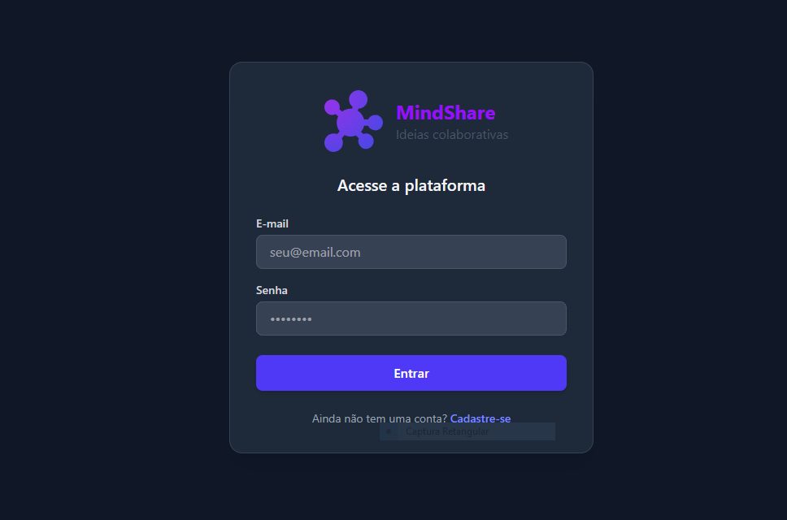

# 💡 MindShare

O **MindShare** é uma plataforma web colaborativa, moderna e de alto desempenho projetada para o compartilhamento de ideias inovadoras dentro de grupos de trabalho ou estudo. Com foco em uma experiência do usuário premium, o projeto combina funcionalidades robustas com design responsivo refinado.

---

## 📸 Captura do Site



---

## ✨ Funcionalidades Principais

- **🔒 Autenticação de Usuários**: Fluxo completo de cadastro de conta e login seguro com persistência e autenticação baseada em tokens JWT.
- **📊 Painel de Controle (Dashboard)**:
  - Visualização de todos os grupos dos quais o usuário faz parte.
  - Central de **Convites Pendentes** com opção em tempo real para *Aceitar* ou *Recusar* convites diretamente da tela principal.
- **👥 Gestão Dinâmica de Grupos**:
  - Criação rápida de novos grupos de discussão (nome e descrição opcional).
  - Painel de Administração exclusivo para o criador do grupo, permitindo convidar novos membros via e-mail e excluir o grupo permanentemente.
  - **Remoção de Membros**: Administradores podem remover membros indesejados instantaneamente através de um botão rápido com feedback visual.
- **💡 Compartilhamento de Ideias**: Publicação de propostas com título, descrição formatada, marcação de autor e data de criação.
- **💬 Interatividade Social**:
  - Curtir ideias de outros membros (com animação de loading e atualização de contadores instantâneos).
  - Seção de comentários em tempo real em cada proposta para estimular debates colaborativos.
- **🌀 Componentes Estéticos Avançados**: Loader unificado e flexível (`<Loading />`) configurado para múltiplas apresentações (loaders inline em botões, seções centralizadas e overlays de tela cheia com desfoque).

---

## 🛠️ Tecnologias Utilizadas

A arquitetura do front-end foi desenhada com ferramentas de última geração para proporcionar máxima performance e manutenibilidade:

- **React 19 (Hooks Modernos)**: Criação de interfaces declarativas com renderização eficiente através de `useState`, `useEffect`, `useMemo` e `useCallback`.
- **TypeScript**: Tipagem estática estrita em todos os modelos e componentes, prevenindo bugs em tempo de desenvolvimento.
- **Vite 7**: Servidor de desenvolvimento extremamente rápido e empacotador de produção de altíssima eficiência.
- **Tailwind CSS v4**: Nova versão do framework utilitário, oferecendo transições suaves, variáveis HSL nativas e estilos ultra-responsivos elegantes.
- **React Router DOM v7**: Gerenciamento de rotas e navegação fluida SPA (Single Page Application).
- **BiomeJS**: Ferramenta de alto desempenho para formatação e linting de código, mantendo o padrão estrito de formatação em todo o repositório.

---

## 🚀 Como Executar o Projeto

### Pré-requisitos
Certifique-se de possuir o [Node.js](https://nodejs.org/) instalado em sua máquina.

### Passos para Inicialização

1. **Clonar o repositório e acessar a pasta**:
   ```bash
   git clone <url-do-repositorio>
   cd mindshare
   ```

2. **Instalar as dependências do projeto**:
   ```bash
   npm install
   ```

3. **Executar o servidor de desenvolvimento**:
   ```bash
   npm run dev
   ```
   A aplicação estará rodando por padrão em [http://localhost:5173](http://localhost:5173).

4. **Gerar a build de produção (opcional)**:
   ```bash
   npm run build
   ```
